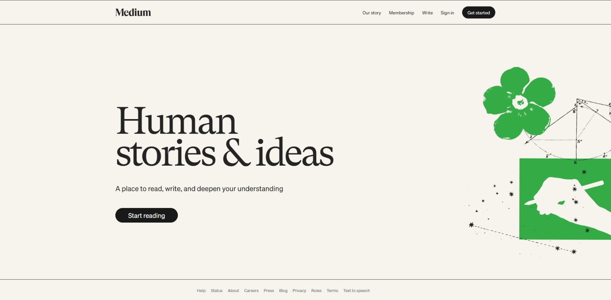

# Medium Landing Page Clone – FD Group 1

**Capstone Project for Frontend Development**  
**BeTechified**

A simplified, responsive recreation of the **Medium.com** homepage (landing page) using only **HTML** and **CSS**.

  

## Project Overview

As part of our Frontend Development course capstone, we built a close visual and structural replica of Medium's iconic landing page.  
The goal was to deeply understand real-world layout patterns, semantic HTML, modern CSS (especially Flexbox), responsive design (media queries), and attention to typography & spacing details that professional sites use.

This project closely follows the assignment guidelines while pushing for higher fidelity to the actual Medium.com design (as of early 2026).

## Features Implemented

- Sticky header / navigation bar with logo and links
- Large hero section with prominent headline, subtitle, CTA button, and illustration (desktop layout)
- Responsive behavior:
  - Mobile: simplified nav (only key links visible), stacked layout
  - Tablet: improved typography & spacing
  - Desktop: side-by-side hero content + large illustration
- Dark footer with light/dark mode color switch based on screen size (inspired by Medium's aesthetic)
- Clean typography using system serif fonts similar to Medium's Charter
- Hover/focus states for better accessibility

## Technologies Used

- HTML5 (semantic elements: header, nav, main, section, footer)
- CSS3 (Flexbox, media queries, position: sticky, custom properties not used but could be added)

## Folder Structure

```
medium-landing-page/
├── index.html          # Main landing page
├── style.css           # All styling
├── image/
│   └── illustration.png   # Hero image
├── README.md
└── screenshot.png   
```

## How to Run / View the Project

1. Clone or download this repository
2. Open `index.html` in any modern browser (Chrome, Firefox, Edge, Safari)
3. Resize the browser window to see responsive behavior

## What We Improved Compared to Basic Skeleton

- Much closer visual match to real Medium.com (typography, spacing, colors, button styles)
- Better mobile nav hiding logic (progressive disclosure)
- Hero image positioned correctly on desktop (absolute + transform)
- Sticky header
- Background color consistency (cream/beige body + black footer)
- More refined button variants (black vs green)

## Known Limitations / Possible Improvements

- No real "features" section content yet (empty in current version) → can add cards/articles previews
- No JavaScript (no dark mode toggle, no smooth scroll, etc.)
- Illustration image is placeholder → could use a more authentic Medium-style graphic
- Accessibility: could add ARIA labels, better contrast checks
- No fonts loaded from Google Fonts/CDN (uses system fonts)

## Team FD Group 1 (Only members that contributed)

- Joshua Kolawole
- Obe Alameen
- Prince Blessed
- Oluwagbemiga Ifeoluwa
- Muritala Fatiu
- Judith Mills
- Machora Caleb
- Esther Gbadamosi
- Adesina Oluwatoyosi
- Ian Sang
- Ralph Precious Chinaza
- James Kehinde Ajayi
- Samuel Adediran


## Acknowledgments

Inspired by [Medium.com](https://medium.com)  
Built for learning purposes only – not for production or commercial use.

---
Made with ❤️ by FD Group 1 – BeTechified
```